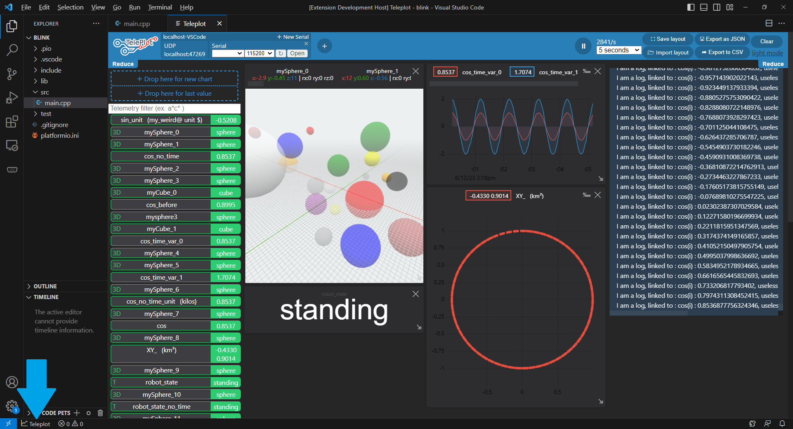

# Teleplot for VSCode

Plots telemetry sent over **Serial** or **UDP Packets**.



## From an Arduino (Serial)

```c++
#include <Arduino.h>

void setup() {
  Serial.begin(115200);
  // Print log
  Serial.println("setup");
}

float i=0;
void loop() {
  i+=0.1;

  // Print log
  Serial.print("loop");
  Serial.println(i);
  
  // Plot a sinus
  Serial.print(">sin:");
  Serial.println(sin(i));

  // Plot a cosinus
  Serial.print(">cos:");
  Serial.println(cos(i));
    
  delay(50);
}
```

Every **serial** message formated `>varName:1234\n` will be ploted in teleplot. Other messages will be printed in the teleplot console.

Serial port needs to be selected and connected at the top-left on Teleplot.

> This format is **specific** to **Serial** messages to enhance ease of use on microcontrollers.


## From any program (UDP)

Teleplot listen to UDP packects on port `47269`, allowing any type of software to post telemetry messages.

- `varName:1234|g` adds or update the `varName` variable value on Teleplot *plots*.
- `varName:1627551892437:1234|g` does the same but specifies the value's timestamp in milliseconds for more accurate ploting.
- `varName:1627551892444:1;1627551892555:2;1627551892666:3|g` does the same as above but publishes multiple values in a single packet.

> For more details on the format and additional telemetry types (like text or 3D shapes), check the [Teleplot README](https://github.com/nesnes/teleplot)

### Bash
```bash
echo "myValue:1234|g" | nc -u -w0 127.0.0.1 47269
```

### C++
Grab `clients/cpp/Teleplot.h` from the [Teleplot repository](https://github.com/nesnes/teleplot).

```c++
#include <math.h>
#include "Teleplot.h"
Teleplot teleplot("127.0.0.1");

int main(int argc, char* argv[])
{
    for(float i=0;i<1000;i+=0.1)
    {
        // Use instanciated object
        teleplot.update("sin", sin(i));
        teleplot.update("cos", cos(i), 10); // Limit at 10Hz

        // Use static localhost object
        Teleplot::localhost().update("tan", tan(i));
        
        usleep(10000);
    }
    return 0;
}
```

## Python

```python
import socket
import math
import time

teleplotAddr = ("127.0.0.1",47269)
sock = socket.socket(socket.AF_INET, socket.SOCK_DGRAM)

def sendTelemetry(name, value):
	now = time.time() * 1000
	msg = name+":"+str(now)+":"+str(value)+"|g"
	sock.sendto(msg.encode(), teleplotAddr)

i=0
while i < 1000:
	
	sendTelemetry("sin", math.sin(i))
	sendTelemetry("cos", math.cos(i))

	i+=0.1
	time.sleep(0.01)
```

## Not listed?

You just need to send a UDP packet with the proper text in it. Open your web browser, search for `my_language send UDP packet`, and copy-paste the first sample you find before editing it with the following options:
	
- address: `127.0.0.1`
- port: `47269`
- your test message: `myValue:1234|g` 